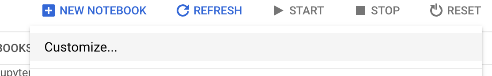
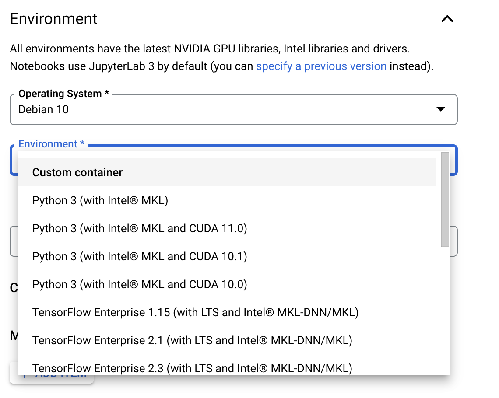

## Container Build Notebook for Tensorflow-Merlin

This notebook is meant to build a container artifact in GCP's artifact registry. This container can then be used downstream to create new managed container instances (see screenshot of GCP console below)

In the console, select new notebook -> customize

!

Next, select a custom container as the environment

!

### Special note on gcsfuse - enable privileged mode
In order for gcsfuse to work in docker containers the container must be run in privileged mode. You can do this by setting the key value pair for the notebook metadata with the key `container-custom-params` and then pass the `--privileged` flag.

Finally, select the container in the Artifact Registry

!

That's it, you should have a merlin image usable with GCP