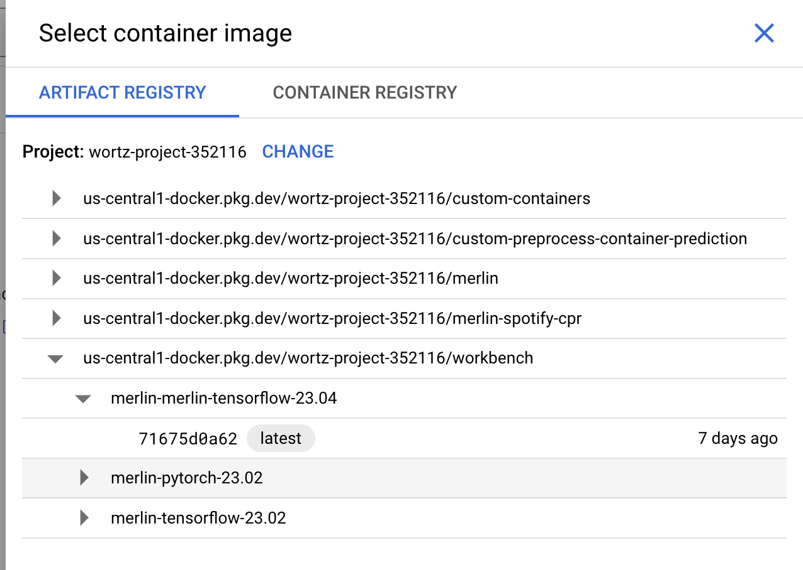

## Container Build Notebook for Tensorflow-Merlin

This notebook is meant to build a container artifact in GCP's artifact registry. This container can then be used downstream to create new managed container instances (see screenshot of GCP console below)

In the console, select new notebook -> customize

!

Next, select a custom container as the environment

!

Finally, select the container in the Artifact Registry

!

That's it, you should have a merlin image usable with GCP